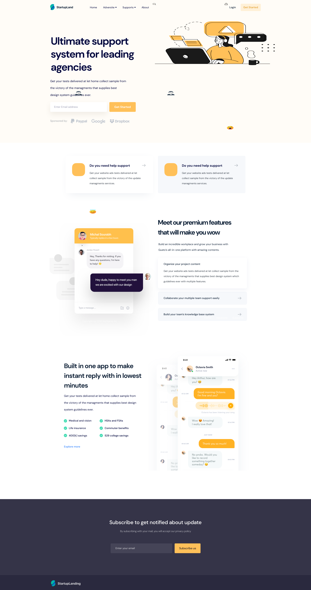

Présentation du projet

L’objectif de ce TP est d’intégrer une maquette graphique puis de la déployer sur une plateforme d’hébergement de votre choix. Pour notre part, nous avons choisi Vercel afin de publier facilement notre projet.

Il s’agit d’une application développée avec Next.js 15, structurée autour d’une architecture simple et intuitive, conçue pour être accessible à tout développeur, même débutant.

Ce projet vise particulièrement les développeurs juniors souhaitant acquérir une meilleure compréhension du développement web moderne.

Enfin, l’application est entièrement responsive, assurant une expérience optimale sur tous types d’écrans.

Pour la maquette en image, voici comment tu peux l’insérer proprement en Markdown (par exemple dans un README.md) :

